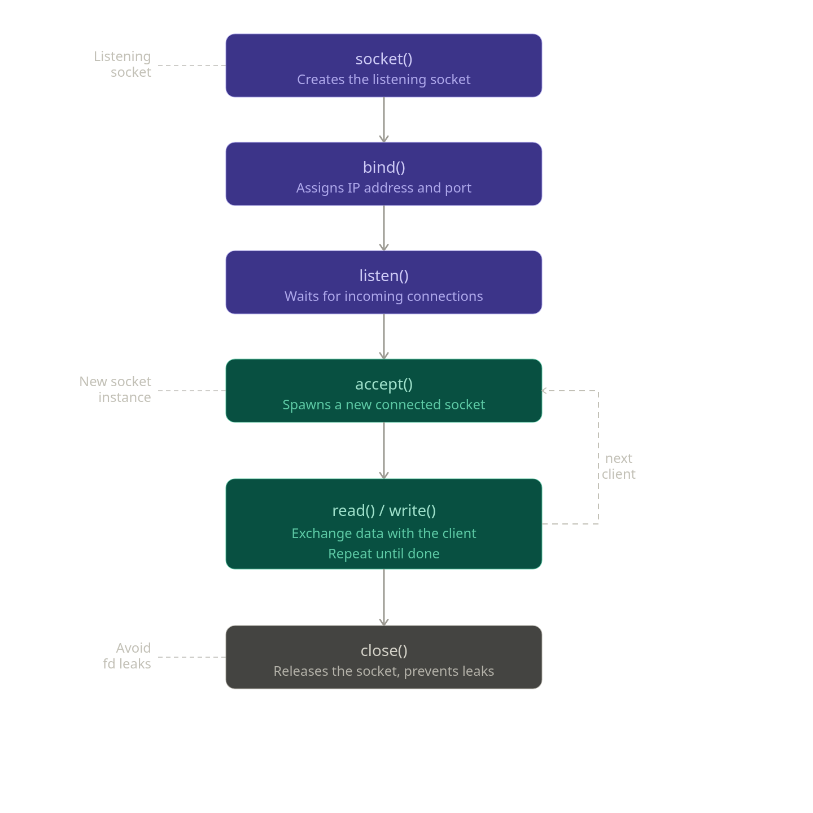
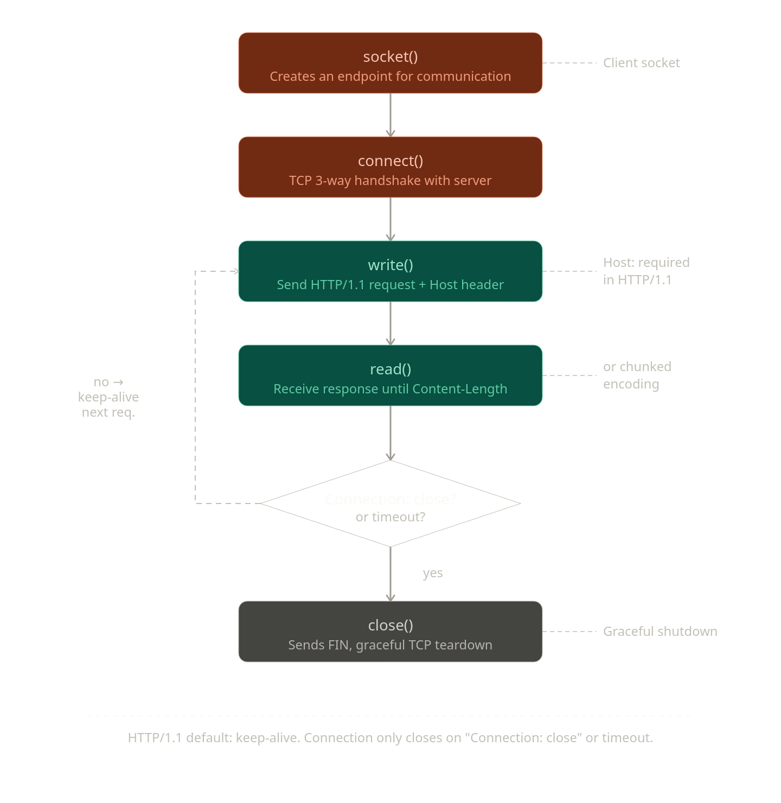

*This project has been created as part of the 42 curriculum by randrade, hguerrei, rduro-pe*

## **📖 CHAPTERS**

- [Description](#description) 👾
- [Instructions](#instructions) 🏁
- [Configuration Guide](#configuration-guide) ⚙️
- [Sockets](#sockets) 🖥️
- [HTTP Features](#http-features) 🚀
- [Resources](#resources) 📚

## **DESCRIPTION**

`Webserv` is a custom-built, lightweight `HTTP/1.1` server written entirely from scratch in C++98. Stripping away modern web frameworks, this project dives deep into the raw mechanics of network programming. It is built to handle both `static file routing` and `dynamic script execution`, serving as a robust engine that translates `HTTP` traffic over raw `TCP` sockets into fully operational web pages.

At its core, the server relies on a highly efficient, single-threaded Event Loop architecture. By utilizing `I/O Multiplexing` with the `poll()` system call and strictly `non-blocking sockets`, the server effortlessly manages thousands of concurrent client connections.

Beyond serving static files, `Webserv` is a resilient and dynamic engine. Key highlights include:

- **NGINX-Inspired Configuration:** A highly strict, hierarchical custom parser that manages virtual hosts, specific URI routing, and HTTP redirections.
- **Dynamic CGI Integration:** Full support for executing external scripts (e.g., Python, PHP) via a zero-blocking architecture using process duplication and bidirectional pipes.
- **Advanced HTTP/1.1 Mechanics:** Comprehensive support for Chunked Transfer Encoding, Multipart/form-data uploads, Range requests, and custom Error Pages.

## **INSTRUCTIONS**

To run `Webserv` simply compile it with `make` and then run program with a `.conf` file as a parameter, that file will need to have the instructions for the structure of the Server(s).

For example this will run a Server with basic configurations:

```bash
./webserv ./config_files/example.conf
```

Running this command provides a more in depth showcase of the Server’s capabilities :

```bash
make exe
```

It’s also possible to edit or create custom configuration files as long as it obeys to the structure defined in the Configuration Guide chapter.

## **CONFIGURATION GUIDE**

The configuration file is heavily inspired by NGINX and is configured using a single, custom `.conf` file. The configuration is hierarchical, consisting of Server Blocks that define local hosts by ports, and Location Blocks that define specific routing rules for URIs.

The configuration parser is highly strict to prevent ambiguous behavior at runtime. Therefore, it enforces strict logical validation to ensure the server always boots in a stable state. When writing or modifying the `.conf` file, make sure to follow these formatting rules:

### SYNTAX

- Non-Linear Declaration:
    
    The order of directives inside a block does not matter. The parser will read and apply all rules correctly regardless of their sequence.
    
- Tokens & Spacing:
    
    Directives and their arguments must be separated by whitespaces (spaces, tabs or even newlines). Multiple spaces are treated as a single delimiter.
    
- Semicolons `;`:
    
    Every single-line directive must be terminated with a semicolon.
    
- Block Contexts `{ }`:
    
    Multi-line contexts, such as server and location, must be enclosed in curly braces. The opening brace can be on the same line or the next line, but the block itself does not end with a semicolon.
    
- Case Sensitivity:
    
    All directive keywords (e.g., server_name, allow_methods) are strictly lowercase and case-sensitive.
    
- Paths & Extensions:
    
    Folder paths should follow standard Unix formatting.
    File extensions for CGI must explicitly include the leading dot (e.g., .php, not php).
    
- Comments:
    
    Any text following a `#` on a line is treated as a comment and completely ignored by the parser.
    

### Directives Description and Rules

> **Server Block**
> 

```markdown
listen <IP:PORT | PORT>: Defines the network interface and port to bind to. (Collisions between different servers with the same port will result in a validation error).
	<Port: 1 <|> 65535>
	<Mandatory directive>
	<Unique directive>

server_name <name>: The domain name associated with the server block.
	<Default - 'localhost'>
	<Unique directive>

client_max_body_size <bytes>: Limits the maximum size of incoming HTTP request bodies. Adding 'M' in the end of the value represents it in Megabytes.
	<Max value = 524288000>
	<Default - 1048576>
	<Unique directive>

root <path>: The default physical directory on the server's hard drive to serve files from.
	<If not defined it must be defined inside location>
	<Unique directive>

error_page <status_code> <path>: Defines a custom HTML file to serve when the server encounters a specific HTTP error (e.g., 404, 500). This overrides the Server's default error response. Multiple directives can be added to the same list, if a status code is repeated it will overwrite the path.
	<Status code: 400 <|> 599>
	<Multiple directive>
```

> **Location Block**
> 

```markdown
location <route_or_extension>: Defines a dedicated configuration block for a specific URI path (e.g., /upload) or file type (e.g., *.php). Directives placed inside this block dictate exactly how the server should route and process requests that match this specific path, overriding global server settings where applicable. Route or extension can't be duplicated, URI and extensions must be unique.
	<Mandatory directive>
	<Multiple directive>
```

Standard Static Routing:

```markdown
allow_methods <GET | POST | PUT | DELETE | HEAD | PATCH>: Restricts which HTTP methods are permitted. If declared multiple allow_methods, it will be added to the config list.
	<Multiple directive>

autoindex <on | off>: Enables directory listing if an index file is not found.
	<Unique directive>

index <file>: The default file to serve when a directory is requested.
	<Unique directive>

upload_store <path>: Required if POST is allowed. Defines where uploaded files are physically saved.
	<Unique directive>

root <path>: The default physical directory on the server's hard drive to serve files from. If not defined inherits from server - if server's also empty it throws an error.
	<Unique directive>

cgi <extension> <executable_path>: Enables CGI execution for specific file types within this standard folder (e.g., cgi .py /usr/bin/python3).
	<Multiple directive>
```

HTTP Redirections:

```markdown
allow_methods <GET | POST | PUT | DELETE | HEAD | PATCH>: Restricts which HTTP methods are permitted. If declared multiple allow_methods, it will be added to the config list.
	<Multiple directive>

return <status_code> <url>: Instantly redirects the client.
	<Status code: 300 <|> 309>
	<Unique directive>

Strict Rule: A redirect block cannot contain root, index, autoindex, cgi, or upload_store directives.
```

CGI Execution (e.g., location *.php):

```markdown
allow_methods <GET | POST | PUT | DELETE | HEAD | PATCH>: Restricts which HTTP methods are permitted. If declared multiple allow_methods, it will be added to the config list.
	<Mandatory directive>
	<Multiple directive>

cgi_pass <executable_path>: Maps the file extension to a specific binary (e.g., /usr/bin/php-cgi).
	<Mandatory directive>
	<Unique directive>

upload_store <path>: Required if POST is allowed. Defines where uploaded files are physically saved.
	<Mandatory directive> <if POST allowed>
	<Unique directive>

Strict Rule: A CGI block cannot contain index, autoindex and return. If POST is allowed - upload_store must be declared.
```

### CONFIG TEMPLATE

```bash
server {
	listen 8080; # alternative - 127.0.0.1:8080
	server_name localhost;
	client_max_body_size 1000000;

	# Global root for all locations
	root ./www/html;

	# Custom Error Pages
	error_page 404 /errors/404.html;
	error_page 500 502 503 504 /errors/50x.html;

	# 1. Standard Folder (With internal CGI support)
	location / {
		  allow_methods GET POST;
	    index index.html;
	    upload_store ./www/uploads;
	    cgi .py /usr/bin/python3; # Python scripts run here!
	}

	# 2. Dedicated CGI Endpoint (Extension matching)
	location *.php {
	    allow_methods GET POST;
	    cgi_pass /usr/bin/php-cgi;
	    upload_store ./www/uploads;
		  # Note: Inherits the global root. If POST is allowed - must define upload_store.
	}

	# 3. HTTP Redirect
	location /old-site {
	    allow_methods GET;
	    return 301 http://127.0.0.1:8080/new-site;
	}
	
	# 4. Directory Listing
	location /directory-listing {
	     autoindex on;
       allow_methods GET;    
	}
}
```

## **SOCKETS**

Sockets are used by operating systems to communicate with different process being able to operate in the machine or in a network.
They work as endpoints in a two sided communication, each one having their own socket that will be used to communicate.

A socket is represented by the IP Address + Port Number.

Representation of a Socket:

```jsx
192.168.1.255::3389
```

**Representation of the life cycle of a Socket for the Server Side:**

The server will start with one socket called Listening Socket, it will be responsible for listening to new sockets that want to connect to the server.


</img>
_Diagram of the Life Cycle of a Server Socket_

In the Client Side the cycle is pretty similar but instead of `accept()` we use `connect()` because the Client is the one who takes the initiative of the connection with the Server.


</img>
_Diagram of the Life Cycle of a Client Socket_

### Non-Blocking Sockets

All of the sockets on this project are Non-Blocking. A Non-Blocking Socket avoids idle threads by never waiting for slow I/O operations. Instead of assigning a dedicated thread to each request, it uses a single thread to handle thousands of concurrent request by leveraging asynchronous I/O and event loop.

### Server

The server is built around a single, centralized `poll()` system call, strictly adhering to the project's requirements. Instead of relying on traditional blocking sockets or spawning a new thread for each client, our server implements **I/O Multiplexing**. It intelligently checks whether an incoming event belongs to a new connection (via the listening socket) or an existing client (via our internal vector of monitored FDs). This entire process is orchestrated by a state machine that reads the `poll()` results and seamlessly dispatches the flow to the correct event handler without ever blocking the main event loop.

### CGI

In a traditional web server, the default behavior is static: the client requests a file (like a `.html` or `.jpeg`), the server reads that file from the disk and sends it back. However, to build dynamic applications (such as processing a login form or interacting with a database), the server must delegate the workload to an external program (like a Python, PHP, JavaScript or Ruby script).

The **Common Gateway Interface (CGI)** is the exact bridge that enables this communication. It is a standard protocol that defines how a web server should format and pass the HTTP request data (Headers, URI, Body) to an executable program, and how it should capture the program's output to send back to the client.

#### CGI Architecture

- **Bidirectional Communication via Pipes:**
The server creates two unidirectional communication channels (*pipes*) in the system's memory:
    - **Input Pipe:** Allows the server to inject the request body (e.g., POST form data) directly into the script's standard input (`STDIN`).
    - **Output Pipe:** Captures everything the script "prints" to its standard output (`STDOUT`).
- **Phantom Execution (Zero-Blocking):**
Through process duplication (`fork()`), the server launches the script in the background. The real magic happens next: instead of waiting for the script to finish, the server **temporarily detaches itself from the child process**. The *File Descriptor* responsible for reading the script's response is configured as non-blocking (`O_NONBLOCK`) and injected directly into our central event monitoring loop.
- **Asynchronous Resumption:**
The server immediately returns to processing other clients. Only when the operating system signals that the script has outputted (or that the *pipe* has data ready), is the event triggered in the main loop. The server then reads the generated data, constructs the final HTTP headers, and delivers the Response using Chunked Transfer Encoding to the original client.

## HTTP FEATURES

Now knowing how the Server runs let’s also see what it’s actually capable of doing.

HTTP (HyperText Transfer Protocol) is the foundation of how communication is made between Client and Server. The Client sends a `Request` to the Server, from it the Server will then create and send a `Response`. For Webserv we decided to follow the HTTP/1.1 version.

### Requests

A `Request` is a message sent by the Client to the Server that specifies what kind of action and answer it wants in return. For example:

```java
GET /home HTTP/1.1
Host: localhost:8080
Connection: keep-alive
Accept: text/html
```

A Request is split in 3 parts. The Request `Line`, the Request `Headers` and the Request `Body`.

They’re sectioned as follows: 

```java
POST /write HTTP/1.1              <--- Request Line
Host: localhost:8080             |<--- Request Headers
Origin: http://localhost:8080    |
Connection: keep-alive           |
Accept: text/html                |

username=http&notes=Lorem+ipsum   <--- Request Body
```

#### | Request Line

The Request Line contains: the `Method`, the `Request URI` and the `Protocol Version`.

The `Method` is the kind of action the Client wants to perform. Our Webserv supports the following Methods:

- GET - retrieves content
- POST - submits content
- DELETE - erases content
- HEAD - retrieves ONLY the size of content

With the method we now need the `Request URI` to know ***where*** to do the Method action. The URI (Uniform Resource Identifier) is the Path that identifies the resource to act upon.

#### | Request Headers

The Request Headers serve both to describe the Request itself and inform how and what to create for the Response. They’re `Key and Value pairs` with metadata about the Request, the Client and the Server.

The Keys are case insensitive so a header key can be “Connection” or “cOnNeCtIOn” and still work the same. 

In our case, the Request Headers we pay most attention to are:

- Content-Length
- Transfer-Encoding
- Range
- Content-Type
- Connection

#### | Request Body

The Request Body is what contains the message body. Having a Request Body is **optional**. The body is separated from the Headers by two `CRLF` (Carriage Return + Line Feed = “\r\n”) which symbolize the end of the Headers.

A Request Body can either have a fixed Length, that must be stated in the `Content-Length` header, or be sent in multiple chunks, which is announced by the `Transfer-Encoding: chunked` header.

When going by the `Content-Length` there’s 5 cases that can happen:

- The header is missing - error Response: LENGTH REQUIRED
- It’s an invalid value - error Response: BAD REQUEST
- Content-Length > Actual body Length - The Server will wait for the rest until Timeout if needed
- Content-Length < Actual Length - The Server will ignore the part of the body that is bigger than the Content-Length, normal Response
- Content-Length == Actual Length - normal Response

When a Request has the `Transfer-Encoding: chunked` header it’s sent in a different format, separating it into `Chunks`. A chunk starts with it’s length written in hexadecimal followed by a `CRLF`, and then when that chunk is over it’s closed off by another `CRLF`.

The Client can send as many chunks as it wants but in the end to signal that it has finished sending the Body it needs to send an ending Chunk of size 0.

```java
7\r\n
Welcome\r\n
1c\r\n
to Lorem ipsum dolor sit ame\r\n
7\r\n
Goodbye\r\n
0\r\n
\r\n
```

There are also others ways the body can come in, such as when the  `Content-Type: multipart/form-data; (…)`  header is present. When that happens the body is divided in parts separated by a boundary. That Content Type is how file uploads are done, for example. 

### Responses

With the Client’s Request as reference the Server can create a Response in reply. It’s structures is as follows:

```java
HTTP/1.1 200 OK               <--- Response Status Line
Connection: keep-alive       |<--- Response Headers
Content-Type: text/html      |
Content-Length: 21           |

<h1>Example Html</h1>         <--- Response Body
```

#### | Response Status Line

The Response Status Line contains:  the `Protocol Version`, the `Status Code` and the `Reason Phrase` .

The `Reason Phrase`, also known as Status Text, summarizes the meaning of the accompanying Status Code.

`Status Codes` are a 3 digit numbers that are split into the following categories:

- 1XX - Informational
- 2XX - Success
- 3XX - Redirection
- 4XX - Client error
- 5XX - Server error

Some common status codes are: 200 OK, 301 Moved Permanently, 302 Found, 400 Bad Request, 404 Not Found, 500 Internal Server Error.

#### | Response Headers

The `Response Headers` serve to give **more information about the Response** that can’t be deduced from the Response Status Line.

The ones this Server sends are:

- Location
- Content-Range
- Transfer-Encoding
- Content-Length
- Last-Modified
- Content-Type
- Connection
- Date

#### | Response Body

The body is either: empty, the content asked by the Request or a error page corresponding to the Status Code. 

When a Request has the `Range` header the Server has to deliver only a specified part of the content. The syntax options are:

```java
unit =   "bytes"

->  <unit>=<range-start>-<range-end>
        ex: 500-600
->  <unit>=<range-start>-
        ex: 500-
->  <unit>=-<suffix-length>        
        ex: -600
->  <unit>=<range-start>-<range-end>, …, <range-startN>-<range-endN>
        ex: 500-600,700-800, 900-1000
```

Then when creating the Response we need a `Content-Range` header specifying what part of the content we are actually returning. The syntax options are:

```java
range =  <range-start>-<range-end> OR "*" when RANGE_NOT_SATISFIABLE
size =   total file size OR "*" when unknown

	-> <unit> <range>/<size>    ex: bytes 0-1023/146515
	-> <unit> <range>/*         ex: bytes 67589/*
	-> <unit> */<size>          ex: bytes */67589
```

To test out the Range header the following command can be used:

```bash
curl http://localhost:8080/home -i -H "Range: bytes=0-100,-50" --output -
```

## **RESOURCES**

<details>
<summary><b>Configuration File Parsing</b> - <i>randrade</i></summary>
    
#### **Configuration Structure and Behavior**

https://nginx.org/en/docs/beginners_guide.html#:~:text=The%20way%20nginx%20and%20its,%2Flocal%2Fetc%2Fnginx%20

https://nginx.org/en/docs/

AI usage:

- Confirming specific behaviors of Nginx;
- Discuss Architecture and structure design ideias;
- Get technical information of some concepts;

> *Disclouser: AI was used consciously and critically, acting as a supplementary learning tool to accelerate understanding, not to skip learning steps. All architectural decisions, code implementations, and debugging sessions were manually driven.*
> 
</details>
    
<details>
<summary><b>Server, Sockets, CGI</b> - <i>hguerrei</i></summary>
    
#### Server Structure Ideas

https://www.youtube.com/watch?v=YwHErWJIh6Y&t=434s

https://medium.com/from-the-scratch/http-server-what-do-you-need-to-know-to-build-a-simple-http-server-from-scratch-d1ef8945e4fa

https://osasazamegbe.medium.com/showing-building-an-http-server-from-scratch-in-c-2da7c0db6cb7

#### Understanding Sockets

	What Are Blocking vs Non-Blocking Web Servers? Key Differences Explained

https://www.youtube.com/watch?v=D26sUZ6DHNQ

https://www.youtube.com/watch?v=gntyAFoZp-E&t=3919s

https://www.youtube.com/watch?v=XXfdzwEsxFk&t=749s

https://www.youtube.com/watch?v=C7CpfL1p6y0&t=1328s

https://www.youtube.com/watch?v=jS9rBienEFQ&t=867s

#### Client and Server interaction

https://www.youtube.com/watch?v=nTK4m66zIf4&t=227s

#### poll

https://www.youtube.com/watch?v=dEHZb9JsmOU&t=429s

https://www.youtube.com/watch?v=O-yMs3T0APU

#### CGI

https://www.youtube.com/watch?v=HL7g1gGuObw

https://www.youtube.com/watch?v=oRQbFwfasvo

https://www.ibm.com/docs/en/i/7.6.0?topic=functionality-cgi

https://en.wikipedia.org/wiki/Common_Gateway_Interface
</details>
    
<details>
<summary><b>HTTP, CGI, HTML, CSS, PYTHON</b> - <i>rduro-pe</i></summary>

---

#### Functions, Exceptions and Namespaces

[Exception Handling using Classes in C++](https://www.geeksforgeeks.org/cpp/exception-handling-using-classes-in-cpp/)\
[cpp seekg() (function)](https://cplusplus.com/reference/istream/istream/seekg/?kw=seekg)\
[cpp rdbuf() (function)](https://cplusplus.com/reference/ios/ios/rdbuf/)\
[cpp std::istream::read() (function)](https://cplusplus.com/reference/istream/istream/read/)\
[Understanding rdbuf() and Its Alternatives](https://runebook.dev/en/docs/cpp/io/basic_ifstream/rdbuf)\
[cpp std::hex (function)](https://cplusplus.com/reference/ios/hex/?kw=hex)\
[how to create a function prototype in a namespace](https://stackoverflow.com/questions/56502207/how-to-create-a-function-prototype-namespace)


---

#### Understanding Sockets/Ports

[Address already in use... sockets in C (setsockopt())](https://stackoverflow.com/questions/15788007/address-already-in-use-sockets-in-c)\
[Mastering the Setsockopt Function](https://thelinuxcode.com/setsockopt-function-c/)\
[HTTP Headers and Cookies](https://youtu.be/DxeSGUM16_4?si=IYmZf-qEzFTNXU8Y)\
[How an HTTP Request Gets Served - In Great Detail](https://youtu.be/hWyBeEF3CqQ?si=9VIuPi0-QtuGF8mf)

---

#### Understanding Requests

[HTTP headers - mdn](https://developer.mozilla.org/en-US/docs/Web/HTTP/Reference/Headers)[POST request method - mdn](https://developer.mozilla.org/en-US/docs/Web/HTTP/Reference/Methods/POST)[HTTP.DEV](https://http.dev/)\
[RFC 1945 - HTTP 1.0](https://datatracker.ietf.org/doc/html/rfc1945)[RFC 2616 - HTTP 1.1](https://datatracker.ietf.org/doc/html/rfc2616)\
[RFC 822 - Internet Standard (3.1) Lexical Tokens](https://datatracker.ietf.org/doc/html/rfc822#section-3.1)\
[RFC 2616 - HTTP 1.1 (page 16) LWS](https://datatracker.ietf.org/doc/html/rfc2616#page-16)\
[RFC 2616 - HTTP 1.1 (4.2) Message Headers](https://datatracker.ietf.org/doc/html/rfc2616#section-4.2)

---

#### Basics os Responses

[HTTP Responses Overview](https://www.tutorialspoint.com/http/http_responses.htm)
[Query Strings and Parameters explained (video)](https://www.youtube.com/watch?v=Z_o7iilNdLQ)

---

#### CGI Environment

[The CGI Process - IBM](https://www.ibm.com/docs/en/i/7.5.0?topic=programming-cgi-process)\
[CGI Environment Variables - CGI101](https://www.cgi101.com/book/ch3/text.html)[CGI Environment Variables - dBASE](http://www.mnuwer.dbasedeveloper.co.uk/dlearn/web/session03.htm)\
[Environment variables in CGI script - IBM](https://www.ibm.com/docs/en/netcoolomnibus/8.1.0?topic=scripts-environment-variables-in-cgi-script)

---

#### Content Type / Content Length

[HTTP Content-Type: What is It & How to Check](https://seomator.com/blog/http-content-type)[Content Types and MIME Types](https://status-code.medium.com/content-types-and-mime-types-how-browsers-interpret-data-4a238e55c54f)\
[What makes an image download instead of opening in a new tab?](https://stackoverflow.com/questions/75506460/what-makes-an-image-download-instead-of-opening-in-a-new-tab)\
[What to Do When HTTP Content-Length Doesn’t Match Actual Body Size?](https://www.codestudy.net/blog/what-to-do-if-http-content-length-differs-from-actual-body-size/)\
[Understanding Content-Length: HTTP Message Handling](https://www.ids-sax2.com/understanding-content-length-avoiding-common-pitfalls-in-http-message-handling/)\
[411 Length Required - httpdev](https://http.dev/411)

---

#### Auto-indexing / Redirections

[Auto-index (directory listing) examples](https://dev.to/ayhan_dev/part-1-stylish-modern-autoindex-in-angienginx-without-sms-and-third-party-modules-3m2i)\
[How to Check a File or Directory Exists in C++?](https://www.geeksforgeeks.org/cpp/how-to-check-a-file-or-directory-exists-in-cpp/)\
[Mastering the opendir() Function for Directory Handling in C](https://thelinuxcode.com/opendir-3-c-function/)\
[HTTP redirections - httpdev](https://http.dev/redirects)

---

#### Transfer Encoding

[Transfer-Encoding - httpdev](https://http.dev/transfer-encoding)[Transfer-Encoding header - mdn](https://developer.mozilla.org/en-US/docs/Web/HTTP/Reference/Headers/Transfer-Encoding)\
[Chunked Transfer Encoding Explained](https://requestly.com/blog/chunked-encoding/)\
[Http Request Chunking (video)](https://www.youtube.com/watch?v=bsyWXrTP8tU)

---

#### File Upload - multipart/form-data, Content-Range

[Understanding multipart/form-data](https://medium.com/@muhebollah.diu/understanding-multipart-form-data-the-ultimate-guide-for-beginners-fd039c04553d)[How to Upload Files with HTML](https://www.freecodecamp.org/news/upload-files-with-html/)\
[302 Found - mdn](https://developer.mozilla.org/en-US/docs/Web/HTTP/Reference/Status/302?utm_source=devtools&utm_medium=devtools-netmonitor&utm_campaign=default)\
[Range header - mdn](https://developer.mozilla.org/en-US/docs/Web/HTTP/Reference/Headers/Range)[Content-Range header - mdn](https://developer.mozilla.org/en-US/docs/Web/HTTP/Reference/Headers/Content-Range)\
[HTTP range requests - mdn](https://developer.mozilla.org/en-US/docs/Web/HTTP/Guides/Range_requests)[416 Range Not Satisfiable - httpdev](https://http.dev/416)\
[Simple Trick to Check Overlapping Intervals (video)](https://www.youtube.com/watch?v=daLeQLFtLLI)\
[How to sort a map/unordered\_map in c++ based on keys or values (video)](https://www.youtube.com/watch?v=viOV5NMbLxE)\
[The Multipart Content-Type (boundary rules)](https://www.w3.org/Protocols/rfc1341/7_2_Multipart.html)\
[How does HTTP Deliver a Large File?](https://cabulous.medium.com/how-http-delivers-a-large-file-78af8840aad5)[How to cancel an HTTP upload?](https://stackoverflow.com/questions/18367824/how-to-cancel-http-upload-from-data-events)\
[413 Content Too Large - mdn](https://developer.mozilla.org/en-US/docs/Web/HTTP/Reference/Status/413)\
[What is the maximum length of a URL?](https://stackoverflow.com/questions/417142/what-is-the-maximum-length-of-a-url-in-different-browsers)

---

#### HTML / CSS

[Create a Sticky Note Effect in CSS/HTML](https://webdesign.tutsplus.com/create-a-sticky-note-effect-in-5-easy-steps-with-css3-and-html5--net-13934t)[Lifted Paper Strips (buttons) CSS/HTML](https://codepen.io/BastianAndre/pen/eBBvVz)\
[CSS/HTML postcard form example](https://mdn.github.io/learning-area/html/forms/postcard-example/)\
[Three Column Layout CSS/HTML](https://www.w3schools.com/howto/howto_css_three_columns.asp)[textarea CSS/HTML](https://www.w3schools.com/tags/tryit.asp?filename=tryhtml_textarea2)\
[pinned card CSS/HTML](https://codepen.io/aitchiss/pen/zYKaaJr)[noise grainy effect CSS](https://jsfiddle.net/jimmmy/2ytzh30w/)[Grainy Gradients CSS](https://css-tricks.com/grainy-gradients/)\
[CSS Paper Effect examples (paper stack)](https://blog.stackfindover.com/css-paper-effect-examples/)[Icons Tutorial HTML](https://www.w3schools.com/icons/)\
[Custom styled input type file CSS](https://nikitahl.com/custom-styled-input-type-file)[::file-selector-button CSS - mdn](https://developer.mozilla.org/en-US/docs/Web/CSS/Reference/Selectors/::file-selector-button)

---

#### Python

[Working With JSON Data in Python](https://realpython.com/python-json/)[Parsing a JSON file with multiple JSON objects](https://stackoverflow.com/questions/12451431/loading-and-parsing-a-json-file-with-multiple-json-objects)\
[Working with Query Strings and Parameters in Requests](https://www.pythonlore.com/working-with-query-strings-and-parameters-in-requests/)\
[Decoding query strings in Python](https://www.urldecoder.io/python/)\
[cgi 101 - making a cgi that posts into a file and redirects to another cgi](https://www.cgi101.com/book/ch6/text.html)

---

> *Disclouser: AI was not used in any step of the HTTP development nor research.*
>
</details>